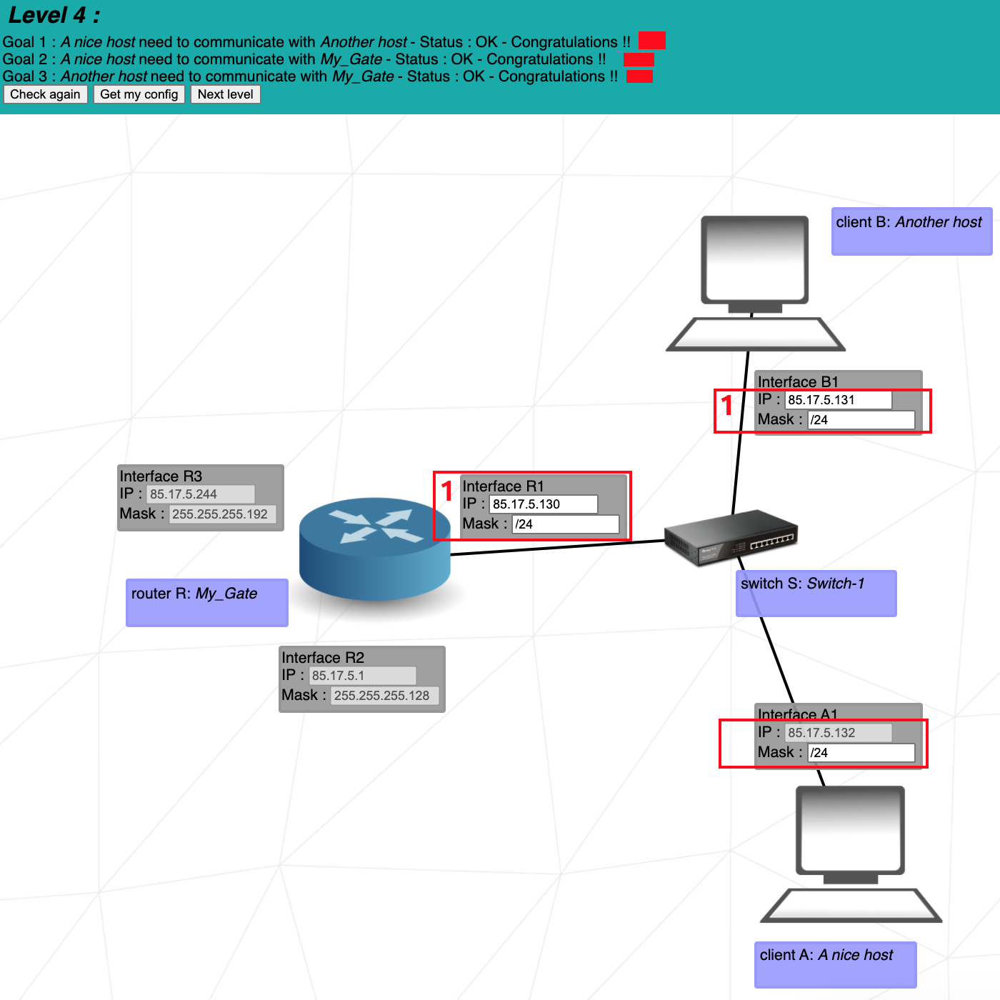
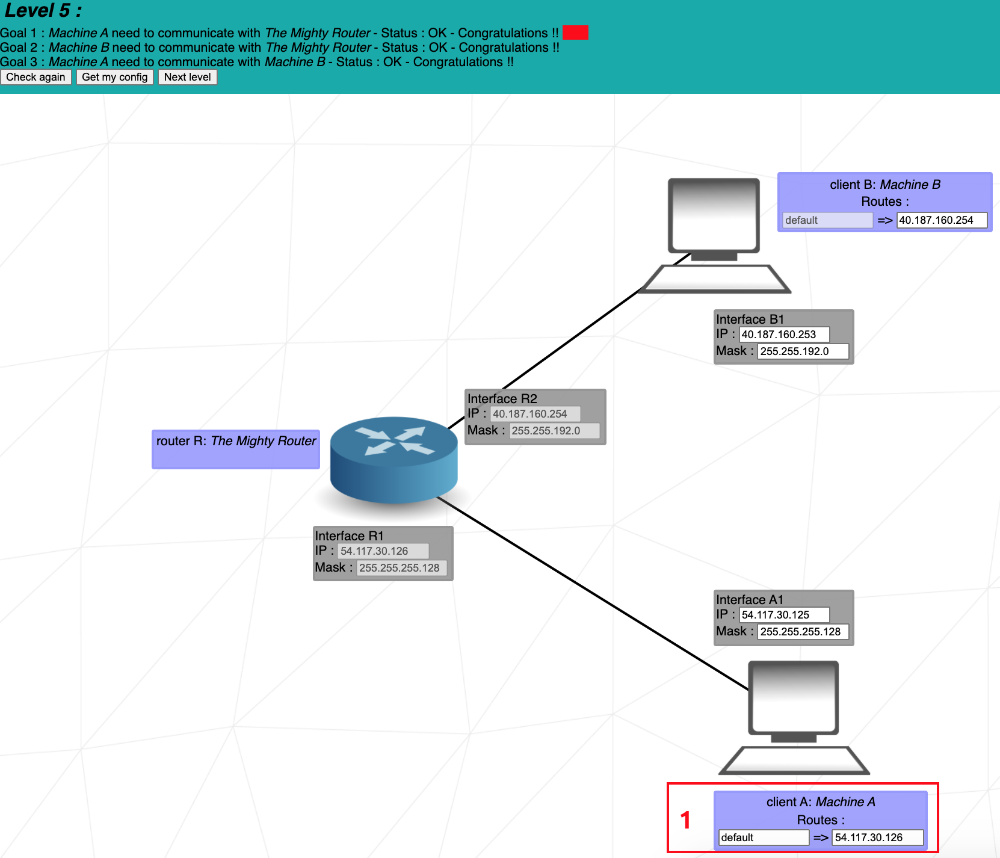
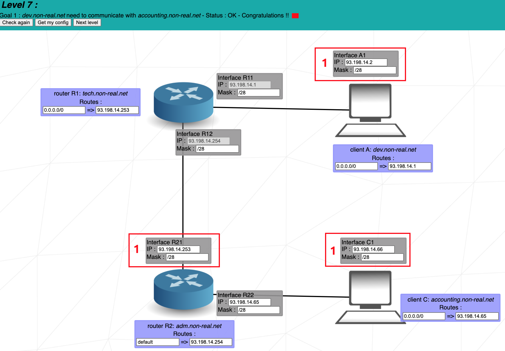
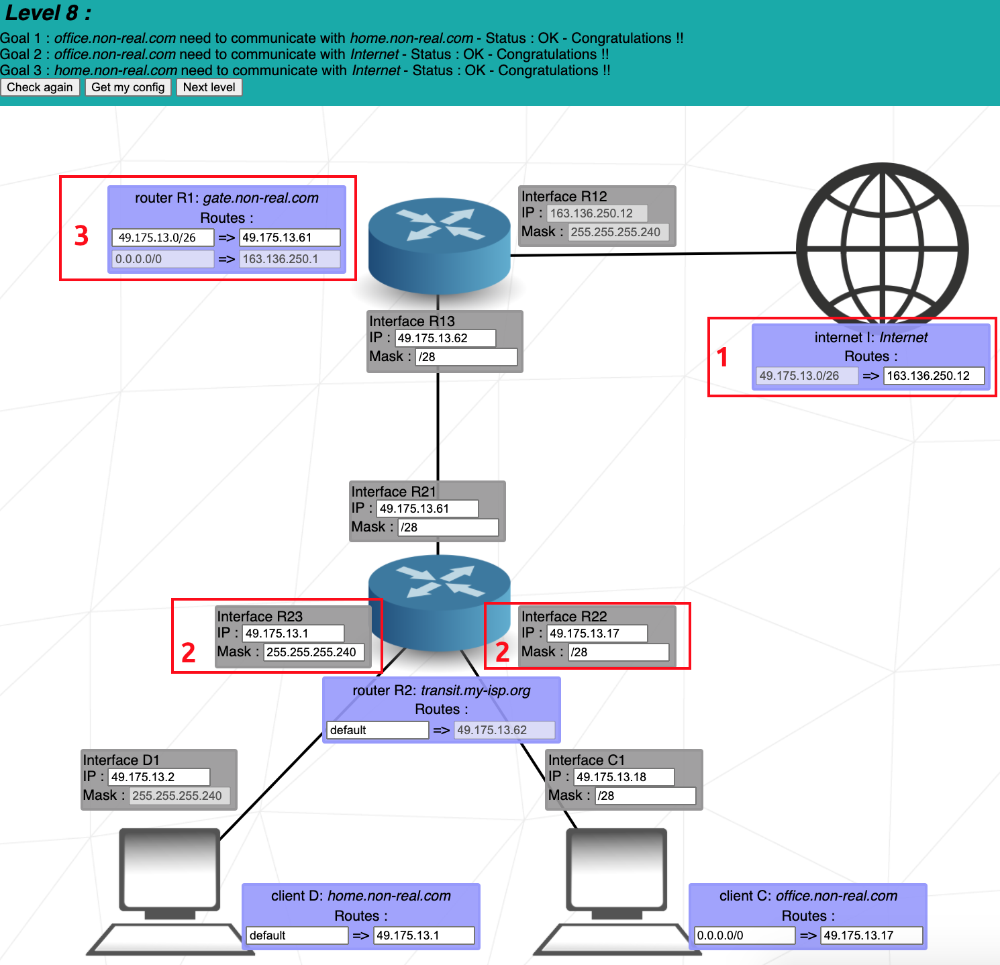
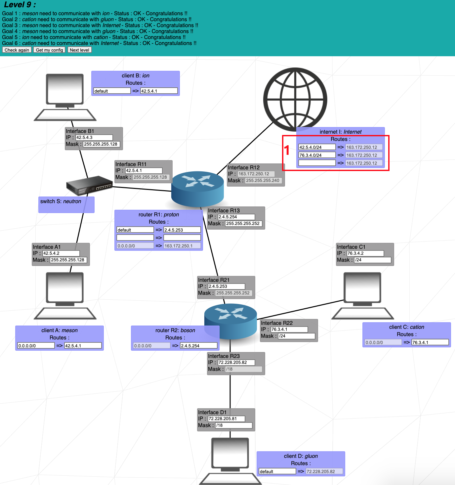
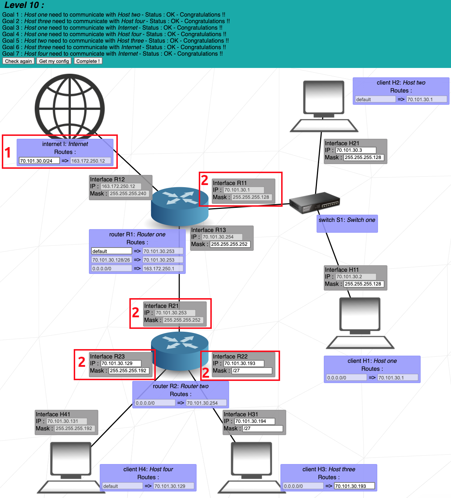

# Net Practice

## 42cursus' project #10
The net_practice project is our first networking related project in the 42 curriculum. It consists of 10 exercises in which you configure different small-scale networks to communicate with each other, using concepts learned about TCP/IP addressing.


Final score: Complete all levels for full credit.

IP is a connectionless protocol that operates at the network layer of the OSI model. IP enables communication between hosts by carrying data within packets. Each host is assigned an IP address which is used to ensure that traffic is sent to the correct destination, synonymous in many ways to a postal address that we place on a letter.

An IP address (in the case of v4) is built upon 32-bits, expressed in four numbers known as octets. Each octet is 8 bits i.e one byte.
- `Network` - the network the IP address belongs to. For example the street name.
- `Host` - the host identifier of the device for the network. For example the house number.


### What is Subnet Mask?
A subnet mask is a 32-bit number created by setting host bits to all 0s and setting network bits to all 1s. In this way, the subnet mask separates the IP address into the network and host addresses.

The “255” address is always assigned to a broadcast address, and the “0” address is always assigned to a network address. Neither can be assigned to hosts, as they are reserved for these special purposes.


### Subnet Mask Chart
Here is a quick reference table for help when subnetting.
|Subnet Mask 	|CIDR |	Binary Notation| 	Network Bits| 	Host Bits| 	Available Addresses|
| -           | -   | -              | -            | -          | -                   | 
|255.255.255.255| 	/32| 	11111111.11111111.11111111.11111111| 	32| 	0| 	1|
|255.255.255.254| 	/31| 	11111111.11111111.11111111.11111110| 	31| 	1| 	2|
|255.255.255.252| 	/30| 	11111111.11111111.11111111.11111100| 	30| 	2| 	4|
|255.255.255.248| 	/29| 	11111111.11111111.11111111.11111000| 	29| 	3| 	8|
|255.255.255.240| 	/28| 	11111111.11111111.11111111.11110000| 	28| 	4| 	16|
|255.255.255.224| 	/27| 	11111111.11111111.11111111.11100000| 	27| 	5| 	32|
|255.255.255.192| 	/26| 	11111111.11111111.11111111.11000000| 	26| 	6| 	64|
|255.255.255.128| 	/25|     11111111.11111111.11111111.10000000| 	25| 	7| 	128|
|255.255.255.0| 	/24| 	11111111.11111111.11111111.00000000| 	24| 	8| 	256|		
|255.255.254.0| 	/23| 	11111111.11111111.11111110.00000000| 	23| 	9| 	512|
|255.255.252.0| 	/22| 	11111111.11111111.11111100.00000000| 	22| 	10| 	1024|
|255.255.248.0| 	/21| 	11111111.11111111.11111000.00000000| 	21| 	11| 	2048|
|255.255.240.0| 	/20| 	11111111.11111111.11110000.00000000| 	20| 	12| 	4096|
|255.255.224.0| 	/19| 	11111111.11111111.11100000.00000000| 	19| 	13| 	8192|
|255.255.192.0| 	/18| 	11111111.11111111.11000000.00000000| 	18| 	14| 	16384|
|255.255.128.0| 	/17| 	11111111.11111111.10000000.00000000| 	17| 	15| 	32768|
|255.255.0.0| 	/16| 	11111111.11111111.00000000.00000000| 	16| 	16| 	65536|	
|255.254.0.0| 	/15| 	11111111.11111110.00000000.00000000| 	15| 	17| 	131072|
|255.252.0.0| 	/14| 	11111111.11111100.00000000.00000000| 	14| 	18| 	262144|
|255.248.0.0| 	/13| 	11111111.11111000.00000000.00000000| 	13| 	19| 	524288|
|255.240.0.0| 	/12| 	11111111.11110000.00000000.00000000| 	12| 	20| 	1048576|
|255.224.0.0| 	/11| 	11111111.11100000.00000000.00000000| 	11| 	21| 	2097152|
|255.192.0.0| 	/10| 	11111111.11000000.00000000.00000000| 	10| 	22| 	4194304|
|255.128.0.0| 	/9| 	11111111.10000000.00000000.00000000| 	9| 	23| 	8388608|
|255.0.0.0| 	    /8| 	11111111.00000000.00000000.00000000| 	8| 	24| 	16777216| 

### Example
```
Address:   192.168.0.1           11000000.10101000.00000000 .00000001
Netmask:   255.255.255.0 = 24    11111111.11111111.11111111 .00000000
Wildcard:  0.0.0.255             00000000.00000000.00000000 .11111111
=>
Network:   192.168.0.0/24        11000000.10101000.00000000 .00000000 (Class C)
Broadcast: 192.168.0.255         11000000.10101000.00000000 .11111111
HostMin:   192.168.0.1           11000000.10101000.00000000 .00000001
HostMax:   192.168.0.254         11000000.10101000.00000000 .11111110
Hosts/Net: 254                   (Private Internet)
```

## 🧰 Tools
[IP Calculator](https://jodies.de/ipcalc) - ipcalc takes an IP address and netmask and calculates the resulting broadcast, network, Cisco wildcard mask, and host range.


## Table of Contents
- [What is a Network?](#what-is-a-network)
- [TCP and IP Address](#tcp-and-ip-address)
- [IPv4 and Subnet Masks](#ipv4-and-subnet-masks)
- [Connecting Multiple Devices](#connecting-multiple-devices)
- [Switch](#switch)
- [Router](#router)
- [Routing Table](#routing-table)
## Table of Contents
- [What is a Network?](#what-is-a-network)
- [TCP and IP Address](#tcp-and-ip-address)
- [Switch](#switch)
- [Router](#router)
- [Routing Table](#routing-table)
- [Levels](#levels)

## What is a Network?
In simple terms, a Network in computing is a group of two or more devices that can communicate amongst each other. By communicating we mean the possibility of sending and receiving data (or packets) between different devices (or nodes).

The Internet is one of many examples of a network. It is probably the biggest network in the world, and connects many different nodes, making the sharing of data available between devices located anywhere in the world.

On the other hand, we also have Private Networks. A Private Network allows for communication between devices that are restricted to a specific location or domain. The data transfer is not allowed for anyone unregistered, making it a much safer and controlled environment. A Home Network is an example of private network. In there, you can connect to your personal printer when no one who isn't connected to your house's Wi-Fi, for example, could.


Transmission Control Protocol (TCP) is a communication standard protocol that enables nodes to communicate with each other. TCP is responsible for breaking data into small pieces (packets), sending them over the network, and then rebuilding them while ensuring there is no data lost in the process.

IP (Internet Protocol) assigns unique addresses to devices for identification and routing. TCP and IP are not the same thing, but rather two separate protocols that work together to ensure data transfer between different devices.
There are two versions of IP Addresses: IPv4 and IPv6. For this project, only IPv4 is needed.

## IPv4 and Subnet Masks

It is fundamental to learn how to visualize each IP Address in its binary form. Every IP Address can be split into two pieces of information: the Network and the Host address.

Masks can be represented as a full IP Mask or by CIDR notation.

### Example 1
- IP Address: 153.172.250.12
- Subnet Mask: 255.255.255.0
- Network Address: 153.172.250.0
- Usable IPs: 153.172.250.1 to 153.172.250.254

### Example 2
- IP Address: 153.172.175.12
  - Subnet Mask: 11111111.11111111.11110000.00000000

When reading a mask from left to right, once a zero appears, the mask will be completed with only zeros. For masks, there are only nine possible 8-bit blocks:

0, 128, 192, 224, 240, 248, 252, 254, 255

When dividing a larger network into subnets, reserve 2 IP addresses:
- The first IP in the range identifies the subnet.
- The last IP is reserved for broadcasting messages across all devices in the subnet.

#### CIDR Table
| CIDR | Subnet Mask | # of IPs | Usable IPs |
|------|-------------|----------|------------|
| /32  | 255.255.255.255 | 1 | 1 |
| /31  | 255.255.255.254 | 2 | 2 |
| /30  | 255.255.255.252 | 4 | 2 |
| /29  | 255.255.255.248 | 8 | 6 |
| /28  | 255.255.255.240 | 16 | 14 |
| /27  | 255.255.255.224 | 32 | 30 |
| /26  | 255.255.255.192 | 64 | 62 |
| /25  | 255.255.255.128 | 128 | 126 |
| /24  | 255.255.255.0   | 256 | 254 |
| ...  | ...             | ... | ... |

## Connecting Multiple Devices
Public Networks like the Internet are established by telecommunication providers to connect devices globally. A Public IP Address is assigned by your Internet Service Provider (ISP) to your router, allowing connectivity to your private network.

Your private network is established by a switch inside your router. The router assigns Private IP Addresses to devices connected to your network, following subnet mask and IP rules.

### Reserved IP Ranges
| Range | Purpose |
|-------|---------|
| 10.0.0.0 - 10.255.255.255 | Private IPs (Class A) |
| 127.0.0.0 - 127.255.255.255 | Loopback and internal testing |
| 172.16.0.0 - 172.31.255.255 | Private IPs (Class B) |
| 192.168.0.0 - 192.168.255.255 | Private IPs (Class C) |
| 224.0.0.0 – 239.255.255.255 | Multicast |
| 240.0.0.0 – 255.255.255.255 | Experimental/research |

## Switch
A network switch is responsible for distributing packets between devices within the same network (usually a LAN). A switch does not have any interface and cannot talk to a network outside of its own.

## Router
A router is responsible for connecting multiple networks together. Every router has an interface for every network it connects to.

Since it connects multiple networks, the range of possible IP addresses on one of its interfaces must never overlap the range of its other interfaces. An overlap would imply the interfaces belong to the same network.

## Routing Table
A Routing Table is a simple data table stored in a router or network host that lists all the routes to a particular network destination.

In Net Practice, a routing table consists of two pieces of information:
- **Destination**: The IP address you want to send a packet to, combined with the CIDR of that network (e.g., 190.3.2.252/30). If you want to make it available for the entire network, set it to default or 0.0.0.0/0.
- **Next Hop**: The IP address of the next router to send the packets to in order to reach the destination network.

## Net Practice Levels
The project includes 10 levels, each with a different network configuration challenge. JSON files (e.g., `level1.json`, `level5.json`) describe the network setup for each level. Each level requires you to:
- Analyze the network topology
- Assign IP addresses and subnet masks
- Configure routing tables
- Ensure connectivity between all required devices

---

### Level Visual Gallery
Below are professional diagrams for each level. Images are organized by level folders for clarity. Make sure your images are named and placed as shown for best results.

| Level | Diagram |
|-------|--------|
| **Level 1**  |  |
| **Level 2**  |  |
| **Level 3**  |  |
| **Level 4**  |  |
| **Level 5**  |  |
| **Level 6**  |  |
| **Level 7**  |  |
| **Level 8**  |  |
| **Level 9**  |  |
| **Level 10** |  |

---

## 📚 References
- [techtarget.com](https://www.techtarget.com/searchnetworking/tip/IP-addressing-and-subnetting-Calculate-a-subnet-mask-using-the-hosts-formula) - How to calculate a subnet mask from hosts and subnets
- [softwaretestinghelp.com](https://www.softwaretestinghelp.com/subnet-mask-and-network-classes/) - Guide to Subnet Mask (Subnetting) & IP Subnet Calculator

- [avinetworks.com](https://avinetworks.com/glossary/subnet-mask/) - Glossary Subnet mask
- [packetcoders.io](https://www.packetcoders.io/a-beginners-guide-to-subnetting/) - A Beginners Guide to Subnetting

- [mtarza13 GitHub](https://github.com/mtarza13)
- [Subnetting Mastery](https://www.practicalnetworking.net/stand-alone/subnetting-mastery/)
- [Cisco: Can two hosts with different subnet masks be on the same subnet?](https://learningnetwork.cisco.com/s/question/0D56e0000BNp5TwCQJ/can-two-hosts-with-different-subnet-masks-be-on-the-same-subnet)
- [IP Subnet Calculator](https://www.calculator.net/ip-subnet-calculator.html)
- [NetworkChuck's Free CCNA Course](https://www.youtube.com/playlist?list=PLIhvC56v63IJVXv0GJcl9vO5Z6znCVb1P)


---
This README summarizes networking concepts and the Net Practice project structure. For details on each level, refer to the corresponding JSON files.
## Author
- GitHub: [mtarza13](https://github.com/mtarza13)
